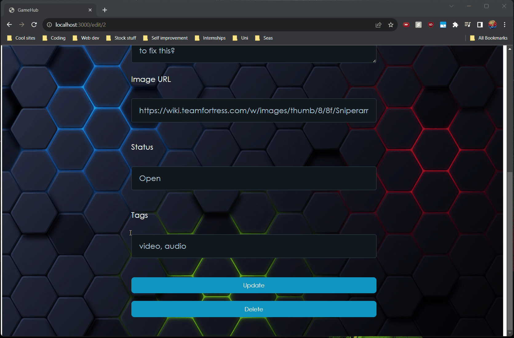

# [GameHub]

CodePath WEB103 Final Project

Designed and developed by: Saad Bin Ihsan, Matthew Li

[🔗 Link to project repository](https://github.com/Ultraman287/WEB103-Final) 

[🔗 Link to Project Plan](https://github.com/users/Ultraman287/projects/2) 

🔗 Link to deployed app: https://web103-final-production-d415.up.railway.app/ 

## About

### Description and Purpose
Description: Generalized forum for guides for different video games. Allowing people to be able to communicate with a chatgpt-like chatbot with the context of the posts on a game
Purpose: With game discussions generally being haphazard, finding an answer to your question about specific attributes can be time-consuming. By making a centralized space, we’ll make it easier for users to find any information they need.

### Inspiration

Saad and I are both avid video game players and have been significantly helped in our gaming sessions in the past thanks to youtubers (WeezyTF2, Game maker’s toolkit, Gamedev) or chat forums such as Steam that would provide walkthroughs or tips. There are many levels no doubt in any game with lots of challenges and have an optimal way to complete.  From personal experience, most of the guides are scattered across multiple sites and especially on youtube, there is more challenge on being able to keep track of which timestamps for very important gaming tips. So, our goal is to create a centralized forum for any games to be discussed and even allow users to make their own contributions to help others. 

## Tech Stack

Frontend: React

Backend: Node

## Backend Features

### ✅ The web app includes an Express backend app and a React frontend app.

As shown in the gif above, the web app includes an Express backend app and a React frontend app.

### ✅ The web app includes dynamic routes for both frontend and backend apps.

As shown in the gif above, the web app includes dynamic routes for both the frontend and backend where the backend api routes handle the requests and the frontend routes handle the rendering of the pages. vite config is used to connection the api route to the separate backend server.

### ✅ The web app is deployed on Railway with all pages and features working.

### ✅ The web app implements at least one of each of the following database relationship in Postgres:
  #### one-to-many
  #### many-to-many with a join table

### ✅ The web app implements a well-designed RESTful API that:
  #### Can respond to at least one of each type of request: GET, POST, PATCH, and DELETE.
  #### Implements proper naming conventions for routes.

As shown in the gif above, the web app implements a well-designed RESTful API that can respond to at least one of each type of request: GET, POST, PATCH, and DELETE with the example of the posts that you are able to create.

### ✅ The web app implements the ability to reset the database to its default state.

As shown in the gif above, when doing npm run start for the server, the database is reset to its original state. You can also do npm run dev instead to not reset the database.

## Frontend Features

### ✅ The web app implements at least one redirection.

As shown in the gif above, the user is redirected to the home page after updating a post.

### ✅ The web app implements at least one interaction that the user can initiate and complete on the same page without navigating to a new page.

As shown in the gif above, the user can hover over a post to see the post's description and tags without navigating to a new page.

### ✅ The web app uses dynamic frontend routes created with React Router.

React Router is used to create dynamic frontend routes as shown from the gif of the repository

### ✅ The web app uses hierarchically designed React components:
#### Components are broken down into categories, including page and component types
#### Corresponding container components and presenter components as appropriate

As can be seen by the gif above, the components are broken down into categories, including page and component types. The corresponding container components and presenter components are also used as appropriate.

## Custom Features 

### ❌ Ability to filter games the user is interested in. (The web app allows filtering and/or sorting as appropriate for your use case)

This will involve basically sorting through and dynamically assigning a game as a topic to wherever a post gets made and allow users to filter for a specific game

[gif goes here]

### ❌ Account information for people who are signed in. (Data is automatically generated in response to a certain event or user action. Examples include generating a default inventory for a new user starting a game or creating a starter set of tasks for a user creating a new task app account.)

This'll allow for users to setup profiles and have their own preferences which might be used as a pub-sub system for people to get updates related to the games they like in a recommendation system

[gif goes here]

## Stretch Features

### ✅ Authentication

Allowing user signup and login

Authentication is integrated using the Github OAuth API. Users can sign in with their Github account and their profile picture will be displayed on the navbar.

### ❌ AI chat bot 

This will allow a user to ask a question about a game and have it be answered generally using the previous forum posts as context for the post.

### [ADDITIONAL FEATURES GO HERE - ADD ALL FEATURES HERE IN THE FORMAT ABOVE; you will check these off and add gifs as you complete them]

## Installation Instructions

[instructions go here]
