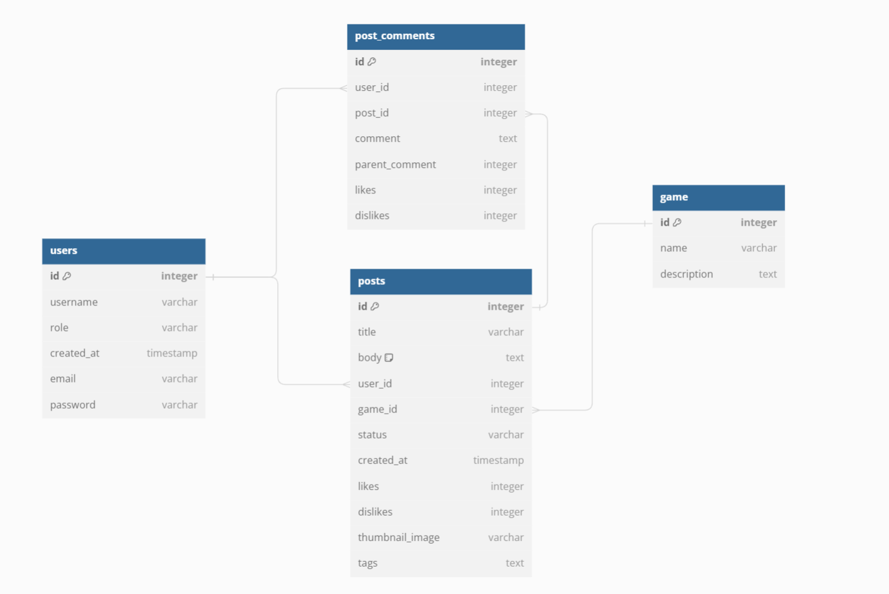

# Entity Relationship Diagram

Reference the Creating an Entity Relationship Diagram final project guide in the course portal for more information about how to complete this deliverable.

## Create the List of Tables

// Use DBML to define your database structure
// Docs: https://dbml.dbdiagram.io/docs

Table users {
  id integer [primary key]
  username varchar
  role varchar
  created_at timestamp
  email varchar
  password varchar
}

Table game {
  id integer [primary key]
  name varchar
  description text
}

Table post_comments {
  id integer [primary key]
  user_id integer
  post_id integer
  comment text
  parent_comment integer
  likes integer
  dislikes integer
}

Ref: post_comments.user_id > users.id
Ref: post_comments.post_id > posts.id

Table posts {
  id integer [primary key]
  title varchar
  body text [note: 'Content of the post']
  user_id integer
  game_id integer
  status varchar
  created_at timestamp
  likes integer
  dislikes integer
  thumbnail_image varchar
  tags text
}

Ref: game.id < posts.game_id

// Table listing {
//   id integer [primary key]
//   title varchar
//   body text [note: 'Content of the post']
//   user_id integer
//   status varchar
//   created_at timestamp
//   likes integer
//   dislikes integer
// }

Ref: posts.user_id > users.id // many-to-one

// Ref: "posts"."title" < "posts"."id"

Ref: posts.user_id > users.id

## Add the Entity Relationship Diagram

